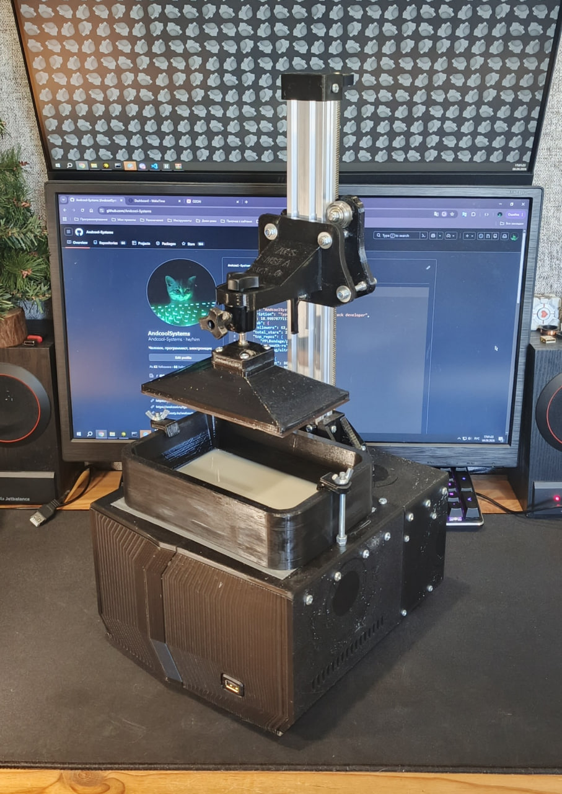
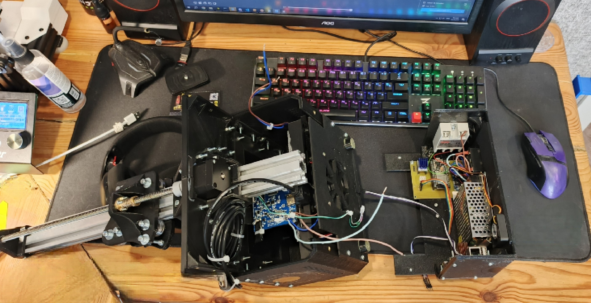
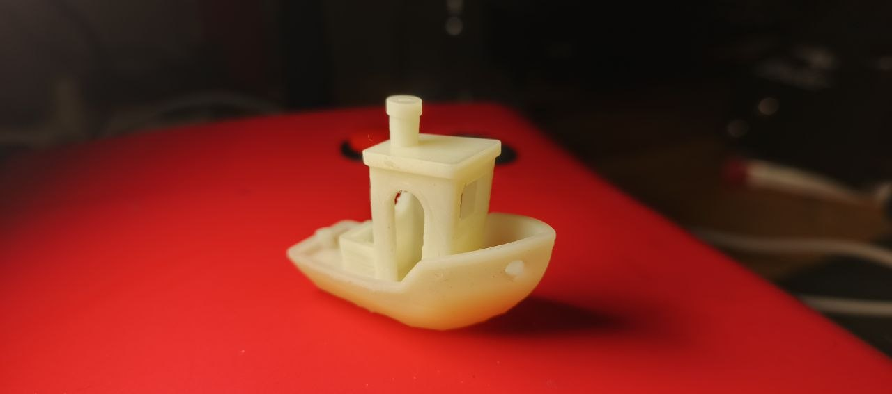

  

<h1 align="center">DIY Open Source MSLA 3D Printer</h1>

<table align="center">
  <tr>
    <td>
      
    </td>
    <td>
      
    </td>
  </tr>
  <tr>
    <td colspan="2">
      
    </td>
  </tr>
</table>

## Description

DIY open-source masked stereolithography (MSLA) 3D printer.

The printer supports printing from `.zip` and `.photon` files and provides a REST API and CLI for controlling the device. The project is designed with extensibility in mind, allowing individual components to be developed and modified independently.

The hardware and software are divided into three main blocks:

* [**Core**](https://github.com/OpenMSLA/msla-core) — the main computing unit based on an Orange Pi 3 LTS running Linux. It handles print file processing, command interpretation, coordination between all components, and hosts the REST API. Written in Rust.

* [**Peripheral ESP32**](https://github.com/OpenMSLA/msla-peripheral) — an ESP32-based peripheral controller. Connected to the Core via USB-to-TTL and responsible for low-level hardware control, including the stepper motor, UV light source, and endstop.

* [**Display ESP32**](https://github.com/OpenMSLA/msla-display) — an ESP32-based user interface controller. Connected to the Core via USB UART and responsible for displaying printer status and handling user interaction through a touchscreen TFT display.

All three blocks communicate using a custom byte-based protocol over UART. The protocol specification will be published later.

### Specifications

* **Build volume (W × D × H):** 154 × 86 × 175 mm
* **Maximum XY resolution:** ~0.2 mm
* **Minimum tested Z step:** 0.05 mm
* **Layer exposure time:** 45 s
* **Bottom layer exposure time:** 450 s
* **Technology:** MSLA

> [!NOTE]
> Hardware schematics, 3D models, and other physical sources will be available later, *one day...*

## Special Thanks
- [@I_KODI_I](https://t.me/I_KODI_I) for the main screen standby pixel art

---

**Created by [AndcoolSystems](https://github.com/AndcoolSystems)**
